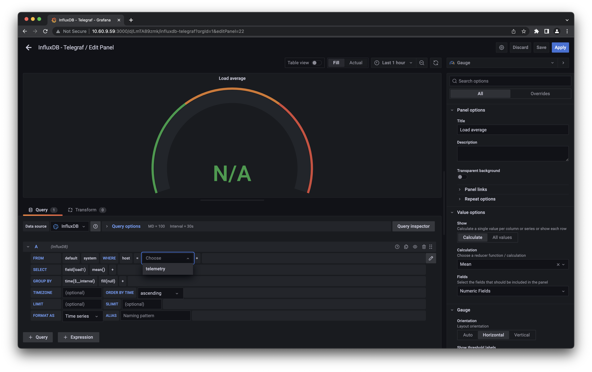

# NXOS telemetry avec Telegraf, InfluxDB et Grafana

## Setup initial TIG

### Installation de la Virtual Machine

#### Prérequis

image : ubuntu-22.04-live-server-amd64.iso

CPUs : 4

RAM : 32G

Disk  :200G Disk thin provisioning

#### IP & credentials

hostname : Telemetry

IP : 192.168.123.59 (10.60.9.123)

username : labuser

password : cisco123

#### Configuration NTP client

Ajouter l’IP du serveur NTP dans `/etc/systemd/timesyncd.conf` :

```
[Time]
NTP=192.168.123.254
```

Redémarrer le service NTP :

```
sudo systemctl restart systemd-timesyncd.service
```

Changer la timezone à Paris (CET +1) :

```
 sudo timedatectl set-timezone Europe/Paris
```

Vérification de la synchronisation NTP :

```
labuser@telemetry:~$ timedatectl
               Local time: Mon 2022-03-21 09:25:33 CET
           Universal time: Mon 2022-03-21 08:25:33 UTC
                 RTC time: Mon 2022-03-21 08:25:34
                Time zone: Europe/Paris (CET, +0100)
System clock synchronized: yes
              NTP service: active
          RTC in local TZ: no
```

#### Accès route en SSH

> Optionnel, permet d’éditer les fichiers de configuration (nécessitant sudo) de la VM TIG à distance en sftp.

Dans le fichier `/etc/ssh/sshd_config`, remplacer

```
#PermitRootLogin prohibit-password
```

par

```
PermitRootLogin yes
```

Redémarrer le service SSH :

```
sudo systemctl restart ssh
```

Assigner un mot de passe au compte root :

```
labuser@telemetry:~$ sudo passwd
New password:
Retype new password:
passwd: password updated successfully
```

### Installation InfluxDB

> Utilisation de InfluxDB 1.8 dans cet exemple. En effet, à partir de la version 2.0 il y a de nombreux changements (Web UI, authentification par token, databases remplacées par buckets, nouveau language de query flux). L'interfaçage de Grafana avec flux reste encore très limité.

Récupération du dernier package InfluxDB 1.8 :

```
wget https://dl.influxdata.com/influxdb/releases/influxdb_1.8.10_amd64.deb
```

Installation du package :

```
sudo dpkg -i influxdb_1.8.10_amd64.deb
```

Paramétrage du service pour qu’il démarre au boot :

```
sudo /bin/systemctl daemon-reload
sudo /bin/systemctl enable influxdb
sudo /bin/systemctl start influxdb
```

Vérification de l’état du service :

```
labuser@telemetry:~$ sudo service influxdb status
● influxdb.service - InfluxDB is an open-source, distributed, time series database
     Loaded: loaded (/lib/systemd/system/influxdb.service; enabled; vendor preset: enabled)
     Active: active (running) since Thu 2022-07-07 13:22:15 CEST; 14s ago
       Docs: https://docs.influxdata.com/influxdb/
    Process: 1373 ExecStart=/usr/lib/influxdb/scripts/influxd-systemd-start.sh (code=exited, status=0/SUCCESS)
   Main PID: 1374 (influxd)
      Tasks: 13 (limit: 38396)
     Memory: 10.1M
        CPU: 238ms
     CGroup: /system.slice/influxdb.service
             └─1374 /usr/bin/influxd -config /etc/influxdb/influxdb.conf
```

### Installation Telegraf

Configuration du repository pour télécharger le package :

```
wget -qO- https://repos.influxdata.com/influxdb.key | sudo tee /etc/apt/trusted.gpg.d/influxdb.asc >/dev/null

source /etc/os-release

echo "deb https://repos.influxdata.com/${ID} ${VERSION_CODENAME} stable" | sudo tee /etc/apt/sources.list.d/influxdb.list

sudo apt-get update
```

Installation du package :

```
sudo apt-get install telegraf
```

Vérification de l’état du service :

```
labuser@telemetry:~$ sudo service telegraf status
● telegraf.service - The plugin-driven server agent for reporting metrics into InfluxDB
     Loaded: loaded (/lib/systemd/system/telegraf.service; enabled; vendor preset: enabled)
     Active: active (running) since Thu 2022-07-07 13:41:00 CEST; 11s ago
       Docs: https://github.com/influxdata/telegraf
   Main PID: 1947 (telegraf)
      Tasks: 9 (limit: 38396)
     Memory: 30.7M
        CPU: 164ms
     CGroup: /system.slice/telegraf.service
             └─1947 /usr/bin/telegraf -config /etc/telegraf/telegraf.conf -config-directory /etc/telegraf/telegraf.d
```

### Installation Grafana

Installation du package `libfontconfi1`, bibliothèque de configuration de polices générique :

```
sudo apt-get install -y adduser libfontconfig1
```

Récupération du dernier package Grafana :

```
wget https://dl.grafana.com/enterprise/release/grafana-enterprise_8.4.4_amd64.deb
```

Installation du package :

```
sudo dpkg -i grafana-enterprise_8.4.4_amd64.deb
```

Paramétrage du service pour qu’il démarre au boot :

```
sudo /bin/systemctl daemon-reload
sudo /bin/systemctl enable grafana-server
sudo /bin/systemctl start grafana-server
```

Vérification de l’état du service :

```
● grafana-server.service - Grafana instance
     Loaded: loaded (/lib/systemd/system/grafana-server.service; enabled; vendor preset: enabled)
     Active: active (running) since Thu 2022-07-07 13:45:29 CEST; 8s ago
       Docs: http://docs.grafana.org
   Main PID: 2419 (grafana-server)
      Tasks: 9 (limit: 38396)
     Memory: 16.7M
        CPU: 381ms
     CGroup: /system.slice/grafana-server.service
             └─2419 /usr/sbin/grafana-server --config=/etc/grafana/grafana.ini --pidfile=/run/grafana/grafana-server.pi <snip>
```

### Configuration initiale

#### Création de comptes InfluxDB

Le compte admin sera utilisé pour les queries dans influxDB (notamment par Grafana). Le compte telegraf sera utilisé par Telegraf pour populer sa database.

```
labuser@telemetry:~$ influx
Connected to http://localhost:8086 version 1.8.10
InfluxDB shell version: 1.8.10
> create user admin with password 'cisco123' with all privileges
> create user telegraf with password 'cisco123' with all privileges
> show users
user     admin
----     -----
admin    true
telegraf true
> quit
```

#### Activation de l’authentification HTTP pour InfluxDB

Modifier le fichier `/etc/influxdb/influxdb.conf` : 

```
[http]
  # Determines whether HTTP endpoint is enabled.
  enabled = true

  # The bind address used by the HTTP service.
  bind-address = ":8086"

  # Determines whether user authentication is enabled over HTTP/HTTPS.
  auth-enabled = true
```

#### Simplifier le fichier de configuration Telegraf

Par défaut, le fichier de configuration `/etc/telegraf/telegraf.conf` contient plus de 9300 lignes. Afin de simplifier la lisibilité, utiliser le template suivant :

```
# Global tags can be specified here in key="value" format.
[global_tags]

# Configuration for telegraf agent
[agent]
  interval = "10s"
  round_interval = true
  metric_batch_size = 1000
  metric_buffer_limit = 10000
  collection_jitter = "0s"
  flush_interval = "10s"
  flush_jitter = "0s"
  precision = ""
  hostname = ""
  omit_hostname = false
  # debug = false
  # quiet = false

###############################################################################
#                            OUTPUT PLUGINS                                   #
###############################################################################

# Configuration for sending metrics to InfluxDB
[[outputs.influxdb]]
  ## The target database for metrics; will be created as needed.
  ## For UDP url endpoint database needs to be configured on server side.
  database = "telegraf"

  ## HTTP Basic Auth
  username = "telegraf"
  password = "cisco123"


###############################################################################
#                            INPUT PLUGINS                                    #
###############################################################################

# Read metrics about cpu usage
[[inputs.cpu]]
  ## Whether to report per-cpu stats or not
  percpu = true
  ## Whether to report total system cpu stats or not
  totalcpu = true
  ## If true, collect raw CPU time metrics
  collect_cpu_time = false
  ## If true, compute and report the sum of all non-idle CPU states
  report_active = false

# Read metrics about disk usage by mount point
[[inputs.disk]]
  ## Ignore mount points by filesystem type.
  ignore_fs = ["tmpfs", "devtmpfs", "devfs", "iso9660", "overlay", "aufs", "squashfs"]

# Read metrics about disk IO by device
[[inputs.diskio]]

# Get kernel statistics from /proc/stat
[[inputs.kernel]]

# Read metrics about memory usage
[[inputs.mem]]

# Get the number of processes and group them by status
[[inputs.processes]]

# Read metrics about swap memory usage
[[inputs.swap]]

# Read metrics about system load & uptime
[[inputs.system]]
```

La section `outputs.influxdb` contient les paramètres d'authentification à InfluxDB. Les métriques envoyées seront poussées dans la database nommée `telegraf`.

Par défaut, plusieurs `inputs` sont activées. Telegraf parse les valeurs de cpu, mémoire, disque, etc ... de la machine sur laquelle il est installé et envoie les métrique associées à InfluxDB.

#### Relancer les services InfluxDB et Telegraf

```
labuser@telemetry:~$ sudo service influxdb restart
labuser@telemetry:~$ sudo service telegraf restart
```

### Vue des métriques de la VM TIG dans InfluxDB

Il est maintenant possible de se connecter à InfluxDB en CLI pour voir les différentes métriques de la VM TIG qui y sont stockées. Ces métriques sont stockées dans une database et classifiées par measurements (un measurement = 1 service input). Une métrique est une serie de fieldkeys marquée avec le temps de l’envoi.

```
Connection à InfluxDB en CLI :
labuser@telemetry:~$ influx -username 'admin' -password 'cisco123'
Connected to http://localhost:8086 version 1.8.10
InfluxDB shell version: 1.8.10
```

Visualisation des databases :

```
 > show databases
name: databases
name
----
_internal
telegraf
```

Accès à la database `telegraf` :

```
> use telegraf
Using database telegraf
```

Visualisation des `measurements` :

```
> show measurements
name: measurements
name
----
cpu
disk
diskio
kernel
mem
processes
swap
system
```

Visualisation des fieldkeys pour le measurement `cpu` :

```
> show field keys from cpu
name: cpu
fieldKey         fieldType
--------         ---------
usage_guest      float
usage_guest_nice float
usage_idle       float
usage_iowait     float
usage_irq        float
usage_nice       float
usage_softirq    float
usage_steal      float
usage_system     float
usage_user       float
```

Visualisation des métriques cpu reçues ces 30 dernières secondes :

```
> select * from cpu where time > now() - 30s
name: cpu
time                cpu       host      usage_guest usage_guest_nice usage_idle        usage_iowait        usage_irq usage_nice usage_softirq usage_steal usage_system        usage_user
----                ---       ----      ----------- ---------------- ----------        ------------        --------- ---------- ------------- ----------- ------------        ----------
1657201180000000000 cpu-total telemetry 0           0                99.52404809618662 0.2755511022044048  0         0          0             0           0.12525050100199733 0.07515030060117704
1657201180000000000 cpu0      telemetry 0           0                99.19678714859518 0.6024096385540398  0         0          0             0           0.10040160642569114 0.10040160642569114
1657201180000000000 cpu1      telemetry 0           0                99.69969969971135 0.20020020020023588 0         0          0             0           0.10010010010010015 0
1657201180000000000 cpu2      telemetry 0           0                99.70029970029316 0                   0         0          0             0           0.09990009990009559 0.19980019980019117
1657201180000000000 cpu3      telemetry 0           0                99.49849548646664 0.20060180541629327 0         0          0             0           0.20060180541625763 0.10030090270812882
1657201190000000000 cpu-total telemetry 0           0                99.39864695565527 0.4760711601102875  0         0          0             0           0.07516913054373335 0.05011275369582817
1657201190000000000 cpu0      telemetry 0           0                99.29859719439166 0.6012024048096684  0         0          0             0           0.10020040080160546 0
1657201190000000000 cpu1      telemetry 0           0                99.69909729186904 0.20060180541622202 0         0          0             0           0                   0.10030090270812882
1657201190000000000 cpu2      telemetry 0           0                99.89979959921443 0                   0         0          0             0           0.10020040080160546 0
1657201190000000000 cpu3      telemetry 0           0                98.69869869870668 1.1011011011011194  0         0          0             0           0.10010010010010904 0.10010010010011794
>
```

### Configuration initiale de Grafana

#### Connection à Grafana

Se connecter en http sur la machine TIG avec le port TCP 3000 (port d’écoute par défaut de Grafana).

Les crédentials par défaut sont **admin** / **admin**.

Change le mot de passe par défaut du compte admin.

#### Ajout de la data source InfluxDB

Cliquer sur Add data source et chosir InfluxDB :


Finir par Save & test. Vérifier que la connection à la Data source est opérationnelle.

#### Dashboard pour les KPIs de la VM TIG

Aller ensuite dans le menu *Import* à travers le bouton + de la barre latérale de gauche. Grafana propose l'import de dashboards prédéfinis. Nous allons en récupérer un qui met en valeur les métriques de cpu, disk, ... de la VM TIG que Telegraf popule déjà. L’ID de ce dashboard est **8451**. Préciser l’usage de la data source `InfluxDB`.


A ca stade, seuls quelques panels sont fonctionnels. Par exemple, le panel *RAM* fonctionne mais par le panel *Load average*.

Cliquer sur la barre de titre *Load average* pour editer le panel. Au niveau de la requête, on voit que le panel fait une requête sur le measurement `system` et le fieldkey `load1` mais sur le mauvais host `nagisa`. Cliquer sur `nagisa` pour changer le host (il va être automatiquement proposé car fait partie des fieldkeys du measurement `system`). Le rendu du panel va immediatement se mettre à jour :



Valider en cliquant sur *Apply*. Répéter l’opération pour les autres panels. Retirer également les panels liés au réseau et à InfluxDB (Telegraf n’envoie aucune métrique par défaut).

